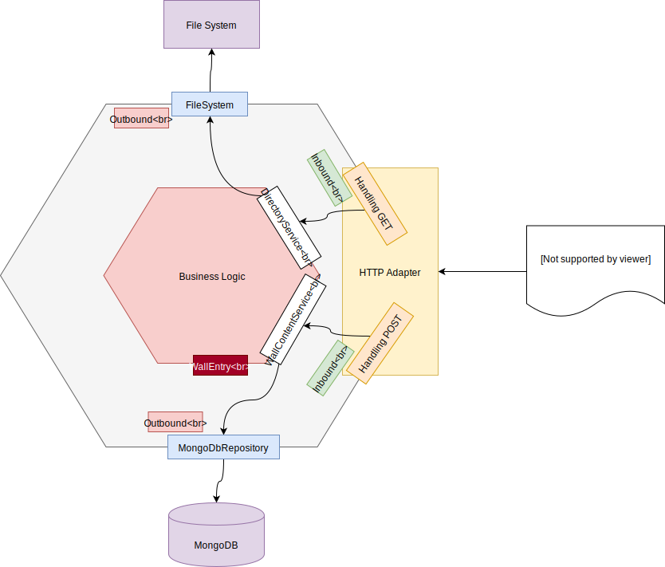
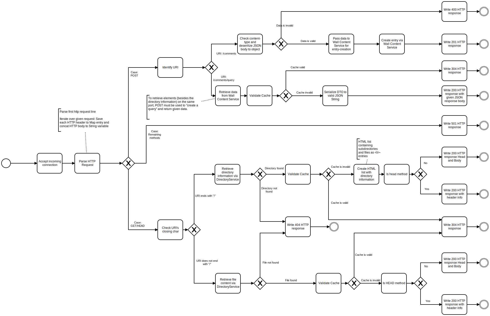
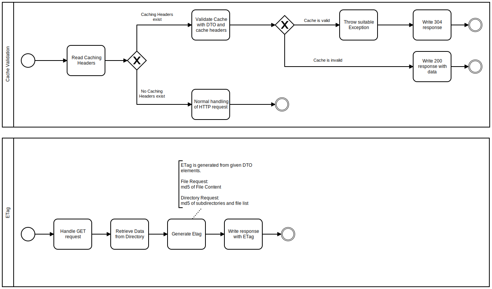
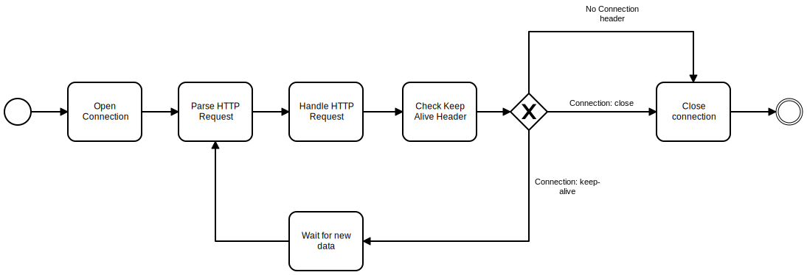

**Application start**

The java application is based on Maven and needs a running MongoDB instance on default port. 
This can be achieved by running the provided docker-compose yml.

`docker-compose -f docker/docker-compose.yml up`

Afterwards you are good to go.

**Architectural approach**

The basic approach of the application is a HTTP server 
written without additional frameworks and using only the standard JDK.

The two functions of the HTTP server are access to the file system and the storage and retrieval of data within a MongoDB. 
The architecture is based on a hexagonal approach so that a meaningful separation can take place between the respective components of the application.

This approach results in a meaningful division for the understanding of the application as well as for the testability of individual components.

In the future, logic implemented with this architectural approach could be used within new communication endpoints in 
a renewed way. The respective accesses to the used persistence layers are therefore reusable and 
adapters (REST endpoint, message queue) do not contain closely coupled application logic.

**Procedural approach**

For the processing of the HTTP connection the approach is shown in a BPMN diagram. 
At this point the respective use of a cache validation is also illustrated.

**Caching**

**Keep Alive**

**The approach to the low-level http connection handling is based on the [tutorial by @ssaurel](https://medium.com/@ssaurel/create-a-simple-http-web-server-in-java-3fc12b29d5fd)**

